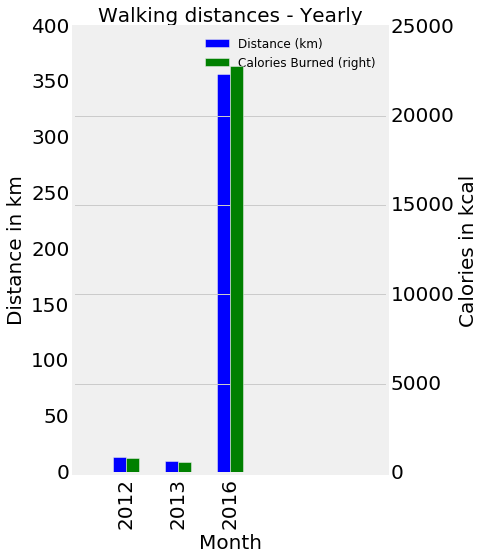
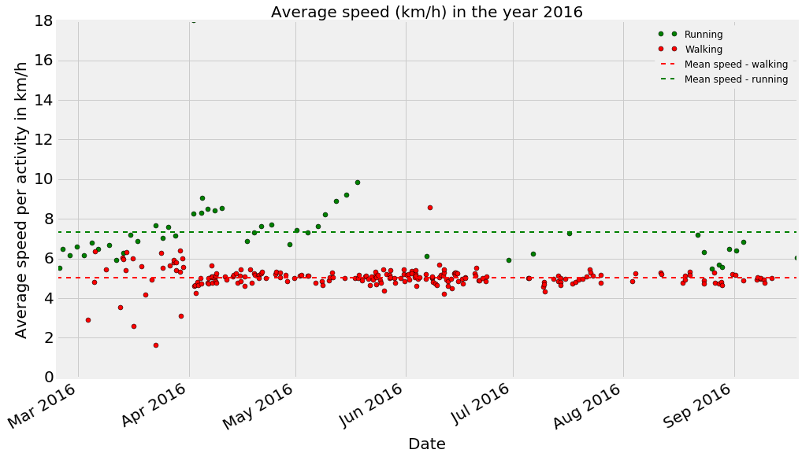
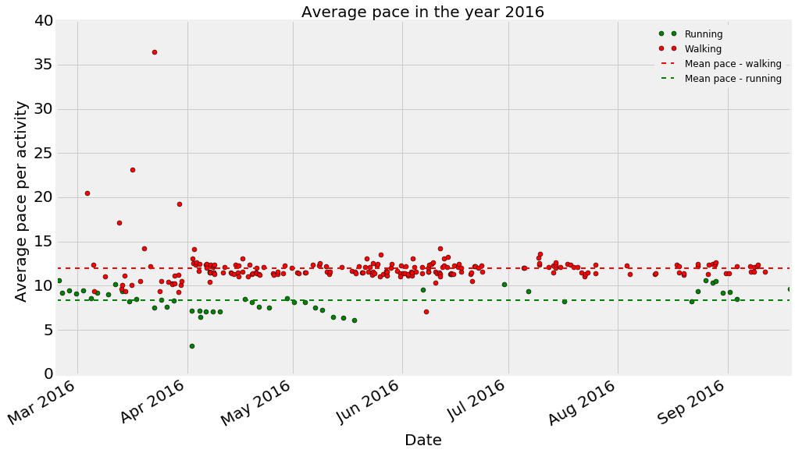
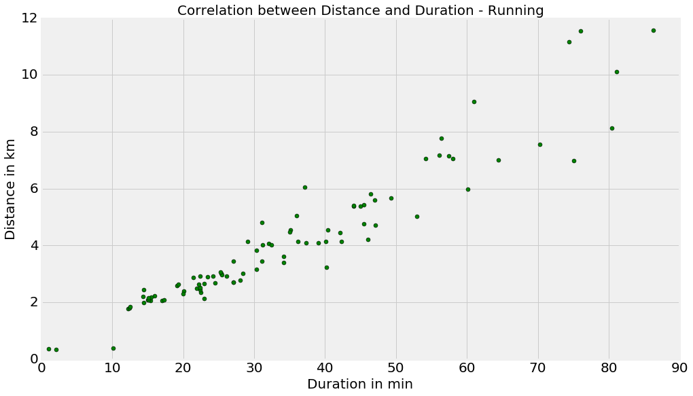

###Runkeeper data Analysis

I took 4 years of my run keeper data and analysed it. The data was exported from my runkeeper profile.

```python
#reading for data in to a DataFrame
df = pd.read_csv('cardioActivities.csv')

```

```python
#Displaying the data frame
df.head()
```


<div>
<table border="1" class="dataframe">
  <thead>
    <tr style="text-align: right;">
      <th></th>
      <th>Date</th>
      <th>Type</th>
      <th>Route Name</th>
      <th>Distance (km)</th>
      <th>Duration</th>
      <th>Average Pace</th>
      <th>Average Speed (km/h)</th>
      <th>Calories Burned</th>
      <th>Climb (m)</th>
      <th>Average Heart Rate (bpm)</th>
      <th>Notes</th>
      <th>GPX File</th>
    </tr>
  </thead>
  <tbody>
    <tr>
      <th>0</th>
      <td>2016-09-18 17:23:13</td>
      <td>Running</td>
      <td>NaN</td>
      <td>8.13</td>
      <td>1:20:47</td>
      <td>9:56</td>
      <td>6.04</td>
      <td>526.000000</td>
      <td>85.85</td>
      <td>NaN</td>
      <td>Slow and good run. Perfect weather.</td>
      <td>2016-09-18-1723.gpx</td>
    </tr>
    <tr>
      <th>1</th>
      <td>2016-09-11 16:21:14</td>
      <td>Walking</td>
      <td>NaN</td>
      <td>1.55</td>
      <td>18:31</td>
      <td>11:58</td>
      <td>5.01</td>
      <td>89.975704</td>
      <td>NaN</td>
      <td>NaN</td>
      <td>Walking</td>
      <td>NaN</td>
    </tr>
    <tr>
      <th>2</th>
      <td>2016-09-09 19:52:37</td>
      <td>Walking</td>
      <td>NaN</td>
      <td>1.36</td>
      <td>17:09</td>
      <td>12:37</td>
      <td>4.75</td>
      <td>84.963795</td>
      <td>NaN</td>
      <td>NaN</td>
      <td>Walking</td>
      <td>NaN</td>
    </tr>
    <tr>
      <th>3</th>
      <td>2016-09-09 14:46:07</td>
      <td>Walking</td>
      <td>NaN</td>
      <td>1.51</td>
      <td>18:29</td>
      <td>12:15</td>
      <td>4.90</td>
      <td>89.021055</td>
      <td>NaN</td>
      <td>NaN</td>
      <td>Walking</td>
      <td>NaN</td>
    </tr>
    <tr>
      <th>4</th>
      <td>2016-09-08 14:53:21</td>
      <td>Walking</td>
      <td>NaN</td>
      <td>1.48</td>
      <td>17:45</td>
      <td>11:58</td>
      <td>5.01</td>
      <td>88.066405</td>
      <td>NaN</td>
      <td>NaN</td>
      <td>Walking</td>
      <td>NaN</td>
    </tr>
  </tbody>
</table>
</div>


####Some aggregated stats about running and walking 
```

    Number of total activities  312
    Total distance  754.53  km
    Total Calories burned  52214  Cal
    Average distance per activity  2.45  km
    Average Calories burned per activity  167  Cal
    --------------------------------------------------
    Number of walking  activities  222
    Total distance in walking  383.25  km
    Average distance per walking activity  1.72635135135  km
    Average Calories burned per walking activity  109  Cal
    --------------------------------------------------
    Number of running activities  90
    Total distance in running  371.28  km
    Average distance per running activity  4.12533333333  km
    Average Calories burned per running activity  308  Cal
    --------------------------------------------------
```


#####Monthly walking distance and calories burned for 4 years. Looks like I have ran more often during this year. 


#####Monthly running distances and calories burned for 4 years. 


#####Yearly walking distances and calories burned for 4 years. 


#####Yearly running distances and calories burned for 4 years. 




#####Average speed per activity during this year(2016). Average speed per activity is calculated by dividing the total distance in each activity by the duration it took to complete the activity.  



#####Average pace per activity during this year(2016). Average pace is average number of minutes takes to complete each kilometer in an activity





#####Correlation between distance and duration for all walking activities. It can be seen that there is high correlation as it is very likely that longer I walk, more distance I cover.


#####Correlation between distance and duration for all running activities. We can see good correlation but not as strongly like in walking. It is because longer I run, more difficult it might become to maintain the speed and hence the distance. 

